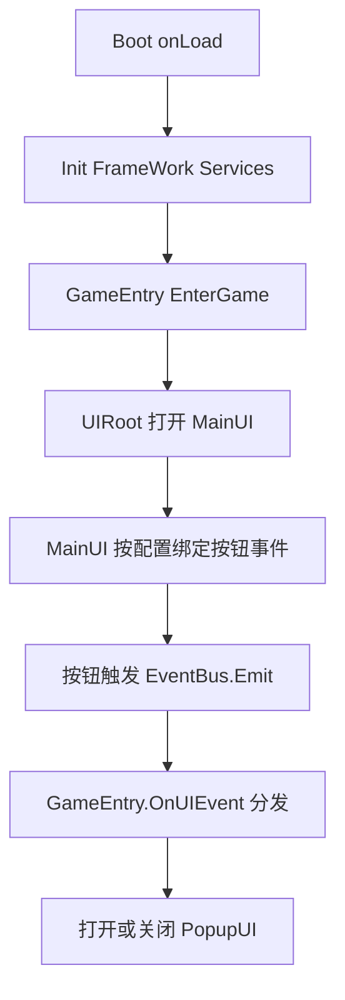

# UIFrameWorkDemo 架构策略

## 1. 目标与原则

本项目采用 轻框架 + 配置驱动 的 UI 架构，核心目标：

- 低耦合：业务逻辑不直接依赖具体按钮节点实现。
- 可复用：UI 节点支持对象池复用，减少频繁实例化开销。
- 可扩展：新增 UI 或交互逻辑时，优先改配置和入口分发，而不是到处改代码。
- 可维护：启动职责清晰，框架层与业务层分离。

---

## 2. 目录分层策略

基于 `assets` 的现有结构，推荐维持以下分层边界：

- `Boot/`
	- 启动入口与全局常驻节点管理。
- `FrameWork/core/`
	- 框架基础能力：事件总线、资源管理、配置管理、UI 根节点管理、UI 对象池、日志。
- `Game/scripts/`
	- 业务侧代码：游戏入口、具体 UI 脚本、业务常量定义。
- `Game/AssetPackage/`
	- 业务资源包（建议继续按 bundle 维度管理，例如 `GUI`、`CONFIG`）。

依赖方向建议：

- `Boot -> FrameWork -> Game`
- `Game` 可调用 `FrameWork` 能力，`FrameWork` 不反向依赖 `Game` 业务实现（允许依赖公共常量）。

---

## 3. 启动链路策略

当前启动链路（见 `Boot.ts`）是合理的，应保持顺序初始化：

1. `EventBus.Init()`
2. `ResMgr.Init()`
3. `ConfigMgr.Init()`
4. `UIRoot.Init()`
5. `UIManager.Init()`
6. `GameEntry.EnterGame()`

关键策略：

- `Boot` 挂载在常驻节点上（`addPersistRootNode`），保证跨场景服务单例稳定。
- 框架服务先于业务入口初始化，避免业务阶段出现未初始化服务。
- 单例组件重复进入时自毁，避免多实例污染。

---

## 4. UI 生命周期策略

### 4.1 统一入口

- 所有 UI 通过 `UIRoot.EnterUIByName(name)` 打开。
- 所有 UI 通过 `UIRoot.ExitUIByName(name)` 关闭。

### 4.2 资源获取与实例化

- 优先从 `UIManager` 对象池取节点（`UIGet`）。
- 池中无节点时，由 `ResMgr` 从 `GUI` bundle 加载 prefab 并实例化。

### 4.3 回收策略

- UI 关闭时，不直接销毁，改为 `UIPut` 回收到池。
- 回收前从层级摘除（`removeFromParent`），保持对象可复用。

这套策略在 UI 频繁开关时可显著降低 GC 压力与加载抖动。

---

## 5. 事件驱动策略

### 5.1 事件总线定位

- `EventBus` 作为全局中介，负责广播与监听。
- UI 层仅发出业务事件，不直接调用其他 UI 逻辑。

### 5.2 事件分发层次

- 一级：`EventType`（如 `UI`）。
- 二级：`UIType`（如 `MainUI`、`PopupUI`）。
- 扩展参数：`payload`。

### 5.3 建议约束

- 监听注册与注销成对出现（参考 `GameEntry.onLoad/onDestroy`）。
- `mainType + subType` 作为业务语义，不在 UI 组件中写硬编码跨界调用。

---

## 6. 配置驱动交互策略

`ConfigMgr` 已实现按 UI 名称读取按钮配置并自动绑事件（`AddButtonEventByConfig`），建议将其作为项目默认交互模式：

- UI 脚本只负责声明“这个界面需要加载按钮配置”。
- 按钮行为、事件类型、目标 UI、payload 放在配置文件维护。
- 通过 `parseEnumValue` 兼容字符串枚举写法，降低配置出错率。

收益：

- 新增按钮交互时可减少代码改动。
- 策划/配置同学可参与部分交互编排。
- 回归测试重点从“按钮是否绑上”转向“配置语义是否正确”。

---

## 7. 资源管理策略

`ResMgr` 采用按需加载 bundle + 资源的方式，建议延续以下规则：

- bundle 名称统一由 `constant.ts` 枚举维护（如 `Bundle.Gui`、`Bundle.Config`）。
- UI prefab 命名与 UI 名称保持一致，保证 `EnterUIByName` 直读。
- 常用配置建议在启动后预热加载（可调用 `ConfigMgr.loadConfig`）。

后续可增强：

- 增加 bundle 缓存，避免重复 `loadBundle`。
- 增加资源引用计数和释放策略（切场景或模块卸载时释放）。

---

## 8. 当前业务流示例

现有链路可抽象为：

---

## 9. 编码与扩展建议

新增一个 UI，建议按以下步骤：

1. 在 `GUI` bundle 中新增同名 prefab。
2. 在 `Game/scripts/ui/` 新增 UI 脚本，并在 `onLoad` 调用 `ConfigMgr.Instance.AddButtonEventByConfig(this.node)`。
3. 在配置文件 `ui_config` 中新增该 UI 的按钮映射。
4. 在 `constant.ts` 补充必要枚举。
5. 在 `GameEntry.OnUIEvent` 增加事件分支。

建议持续遵守：

- UI 不直接管理其他 UI 生命周期，统一走 `UIRoot`。
- 业务触发统一走 `EventBus`，避免节点直接互相持有引用。
- 与资源路径、bundle 名称相关的信息尽量枚举化，减少字符串散落。

---

## 10. 风险与优化方向

当前可见风险：

- `ResMgr` 尚未做 bundle 缓存，重复加载可能带来额外开销。
- `UIManager` 对象池暂无容量上限，极端情况下可能积压节点。
- `Types.ts` 当前为空壳，可作为公共类型定义入口统一收敛。

优先优化建议：

1. 给 `ResMgr` 增加 bundle 缓存与加载状态保护。
2. 给 `UIManager` 增加池容量配置与超限销毁策略。
3. 给 `EventBus` 增加调试开关与事件追踪日志，提升问题定位效率。

以上策略可在不破坏现有代码结构的前提下，逐步演进为可支撑中小型项目的 UI 框架。
